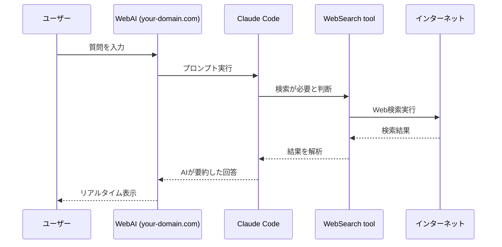

# WebAI Search Service - 機能詳細

## 主要機能

### 1. Claude Code Web検索統合

WebAI Search Serviceの最大の特徴は、Claude CodeのWebSearch toolをWebインターフェースから利用できることです。

#### 動作フロー



### 2. リアルタイム進捗表示

Claude Codeの実行プロセスをリアルタイムで可視化：

- **検索開始通知**: 「🔍 Searching for: [検索クエリ]」
- **ページ取得通知**: 「📄 Fetching: [URL]」
- **処理状況**: 実行中のコマンドや思考プロセス
- **最終回答**: 整形された回答

### 3. 自動Web検索トリガー

以下の条件で自動的にWeb検索を実行：

- 最新情報が必要な質問
- 特定のWebサイトに関する質問
- 時事的な内容の質問
- 製品やサービスの現在の情報

### 4. セキュアアクセス

- **HTTPS通信**: Let's Encryptによる暗号化
- **認証システム**: ログイン必須
- **セッション管理**: セキュアなセッション

## 技術的特徴

### WebSocket通信

```javascript
// クライアント側
socket.on('stream_update', (data) => {
    if (data.type === 'progress') {
        // 検索進捗を表示
    } else if (data.type === 'assistant') {
        // AI回答を更新
    }
});
```

### Claude Code実行

```python
# サーバー側
enhanced_prompt = f"""
あなたはWeb検索機能を持つAIアシスタントです。
必要に応じてWebSearch toolを使用して、
最新の情報や特定のWebサイトの内容を検索してください。

ユーザーの質問: {prompt}
"""

process = subprocess.Popen(['claude', enhanced_prompt], ...)
```

## 利用シナリオ

### 1. 最新ニュース検索

```
ユーザー: 「今日のAI関連の最新ニュースを教えて」
↓
Claude: WebSearch toolで検索
↓
結果: 本日のAI関連ニュースを要約して提供
```

### 2. 製品情報調査

```
ユーザー: 「MacBook Pro M3の価格と性能を教えて」
↓
Claude: Apple公式サイトや各種レビューサイトを検索
↓
結果: 最新の価格と詳細なスペック情報を提供
```

### 3. 特定サイト分析

```
ユーザー: 「your-domain.comのサービス内容を説明して」
↓
Claude: 指定されたWebサイトを直接取得・分析
↓
結果: サイトの内容を構造的に説明
```

## システム要件

### サーバー要件

- Ubuntu 22.04 LTS以上
- Python 3.10以上
- Node.js 16以上（Claude Code用）
- 2GB以上のRAM
- HTTPS対応ドメイン

### クライアント要件

- モダンブラウザ（Chrome, Firefox, Safari, Edge）
- JavaScript有効
- WebSocket対応

## 今後の拡張可能性

1. **マルチユーザー対応**
   - ユーザー管理システム
   - 検索履歴機能
   - パーソナライズ

2. **高度な検索オプション**
   - 検索範囲の指定
   - 言語フィルター
   - 時間範囲指定

3. **API提供**
   - RESTful API
   - WebSocket API
   - 外部連携

4. **分析機能**
   - 検索トレンド分析
   - 利用統計
   - パフォーマンス最適化